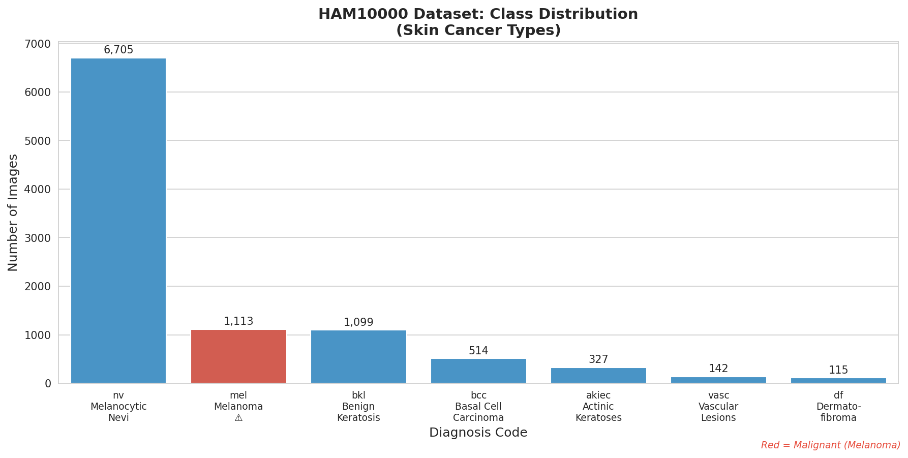
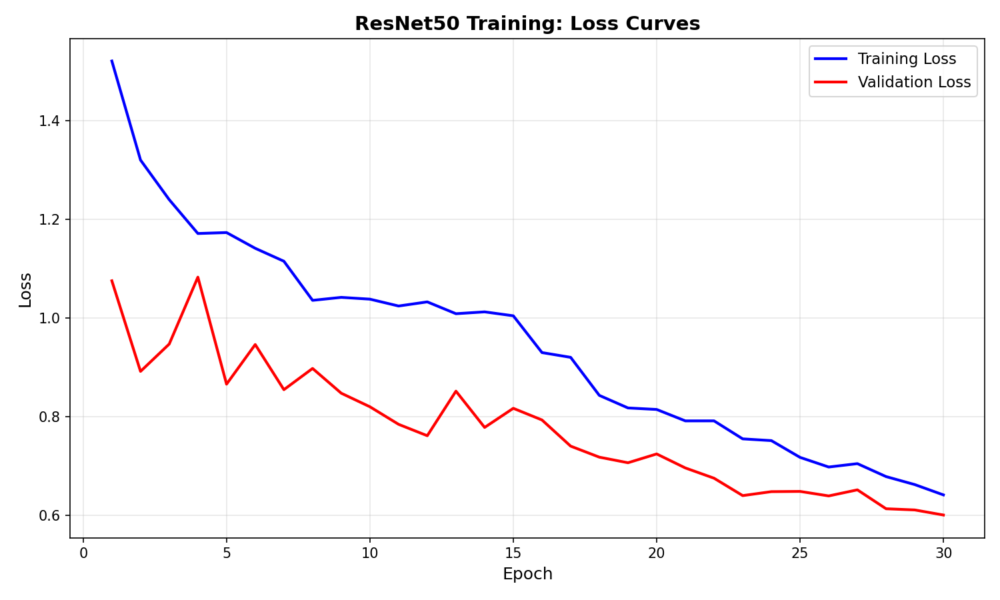
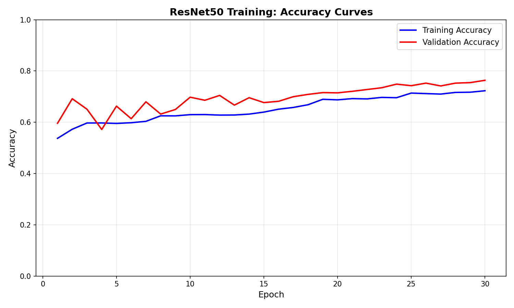
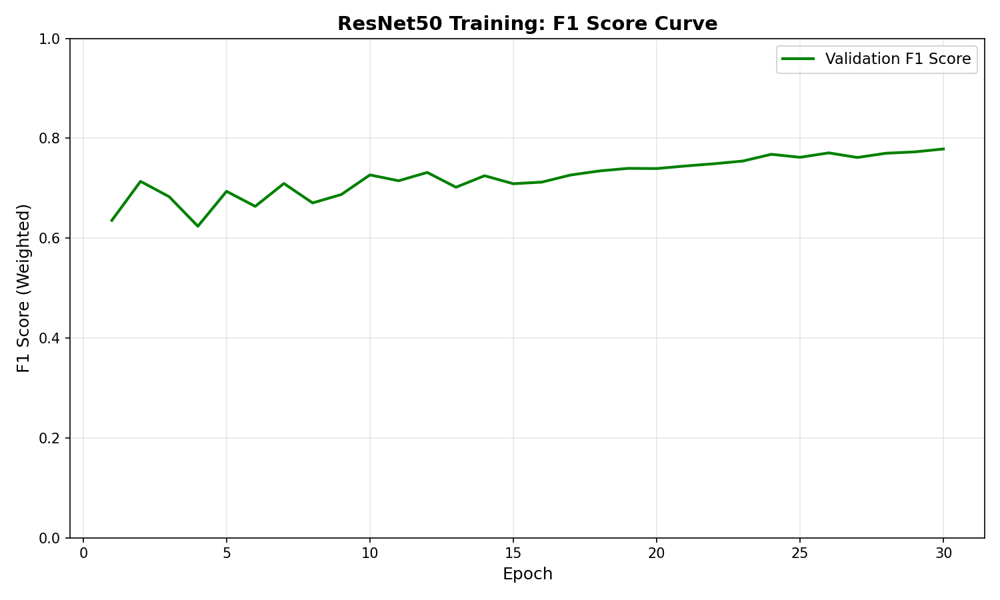
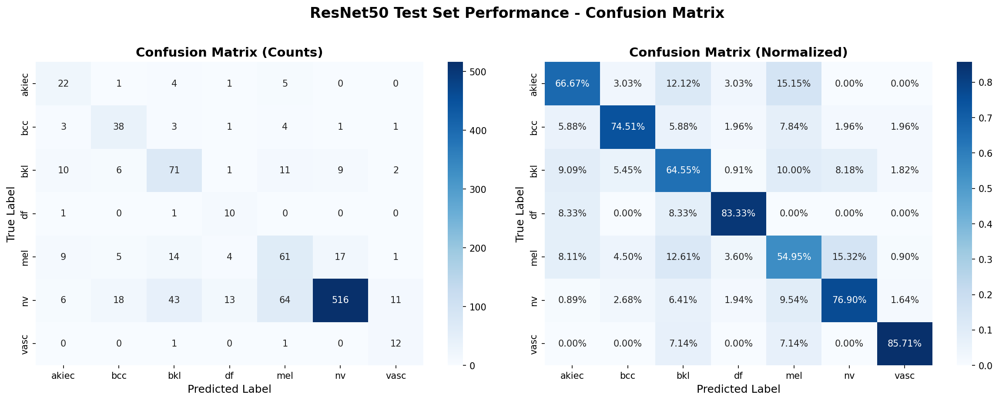
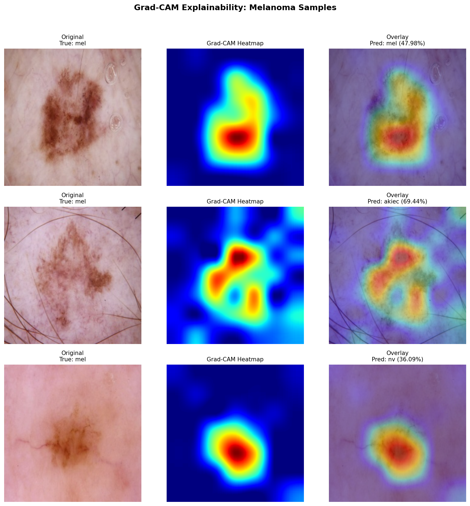

# DermaOps Project Report
## Skin Cancer Detection using Deep Learning

**Project:** DermaOps - AI-Powered Dermatology Assistant  
**Dataset:** HAM10000 (Human Against Machine with 10,000 training images)  
**Author:** DermaOps Development Team  
**Date:** December 7, 2025  
**Version:** 1.0

---

## Executive Summary

DermaOps is an end-to-end machine learning system for automated skin lesion classification, designed to assist dermatologists in early detection of skin cancer. The system classifies dermoscopic images into 7 diagnostic categories, with particular focus on detecting melanoma—the deadliest form of skin cancer.

### Key Achievements

| Metric | Value |
|--------|-------|
| **Model Architecture** | ResNet50 (Transfer Learning + Fine-Tuning) |
| **Test Accuracy** | 72.85% |
| **Test F1 Score** | 0.7486 (Weighted) |
| **Melanoma Recall** | 54.95% (vs 0.9% baseline) |
| **Inference Latency** | 20.44 ms (Real-time) |
| **Deployment** | Docker Compose (Microservices) |

### Technical Stack

- **Deep Learning**: PyTorch 2.x, ResNet50, Grad-CAM
- **Orchestration**: Prefect 3.x (DAG-based workflow)
- **API**: FastAPI + Uvicorn (REST endpoints)
- **Frontend**: Streamlit (Interactive dashboard)
- **Infrastructure**: Docker Compose, CUDA 12.8

---

## Table of Contents

1. [Data Quality Observations](#1-data-quality-observations)
2. [ML Experimentation & Model Comparison](#2-ml-experimentation--model-comparison)
3. [Overfitting & Underfitting Patterns](#3-overfitting--underfitting-patterns)
4. [Model Comparison & Selection](#4-model-comparison--selection)
5. [Orchestration & Reliability (Prefect Pipeline)](#5-orchestration--reliability-prefect-pipeline)
6. [Reliability Improvements via Prefect Orchestration](#6-reliability-improvements-via-prefect-orchestration)
7. [System Architecture & Methodology](#7-system-architecture--methodology)
8. [Future Work](#8-future-work)
9. [Summary](#summary)

---

## 1. Data Quality Observations

### Class Imbalance

- **Observation**: The dataset is highly imbalanced. The class `nv` (Melanocytic nevi) dominates with **6,705 images (66.95%)**, while classes like `df` (Dermatofibroma) have only **115 images (1.15%)**. The imbalance ratio is **58.3:1** between the most and least common classes.

- **Impact**: This severe imbalance means a standard accuracy metric will be misleading (the model could predict "nv" for everything and still get ~67% accuracy). Additionally, rare but critical classes like melanoma (`mel` with 1,113 images, 11.11%) could be underrepresented in predictions.

- **Mitigation Strategy**: I have implemented **Stratified Splitting** in the preprocessing pipeline to ensure the train/validation/test sets all maintain the same class proportions. I will also use **Class Weights** during training to penalize misclassification of minority classes more heavily.

### Missing Data

- **Observation**: The metadata check revealed **57 missing values** in the dataset, all in the `age` column (0.57% of records).

- **Resolution**: The missing age values do not affect our image classification task since we are training on image data only. The core features (`image_id`, `dx` diagnosis label, and image files) have **zero missing values**. No data was dropped as a result.

### Class Distribution Summary

| Diagnosis | Full Name | Count | Percentage |
|-----------|-----------|-------|------------|
| nv | Melanocytic Nevi | 6,705 | 66.95% |
| mel | Melanoma | 1,113 | 11.11% |
| bkl | Benign Keratosis | 1,099 | 10.97% |
| bcc | Basal Cell Carcinoma | 514 | 5.13% |
| akiec | Actinic Keratoses | 327 | 3.27% |
| vasc | Vascular Lesions | 142 | 1.42% |
| df | Dermatofibroma | 115 | 1.15% |
| **Total** | | **10,015** | **100%** |

### Dataset Split (Stratified)

| Split | Images | Percentage |
|-------|--------|------------|
| Train | 8,011 | 80% |
| Validation | 1,002 | 10% |
| Test | 1,002 | 10% |

*Class proportions are maintained across all splits.*



---

## 2. ML Experimentation & Model Comparison

### Experiment A: Baseline Model (Random Forest)

A Random Forest classifier was trained as a baseline to establish a performance floor for comparison.

| Metric | Value |
|--------|-------|
| Validation Accuracy | 69.36% |
| F1 Score (Weighted) | 0.61 |
| F1 Score (Macro) | 0.24 |
| Training Time | 7.85 seconds |

**Observations**: The baseline model heavily favors the majority class (`nv` with 98.36% recall) while completely failing on minority classes (`df` with 0% recall, `mel` with 0.9% recall). The low macro F1 score (0.24) indicates poor performance across all classes.

### Experiment B: ResNet50 with Transfer Learning

#### Phase 1: Feature Extraction (Frozen Backbone)

- **Approach**: Pretrained ResNet50 with frozen convolutional layers, only training the classifier head.
- **Best F1 Score**: 0.7314 (Epoch 12)
- **Observation**: Using a frozen Feature Extractor (Linear Probing) limited the model to ~73% F1 score. This is because the features learned from ImageNet (generic objects like cats, dogs, cars) were not specific enough for dermatoscopy images.

#### Phase 2: Fine-Tuning (Unfreezing layer4)

- **Approach**: Unfreezing the final convolutional block (`layer4`) and fine-tuning with a lower learning rate (1e-5).
- **Best F1 Score**: 0.7784 (Epoch 30)
- **Improvement**: +4.70% F1 score over Phase 1

**Improvement Strategy**: By unfreezing the final convolutional block (`layer4`) and fine-tuning with a lower learning rate (1×10⁻⁵), the model was able to adapt its feature maps to specific skin textures, boosting the F1-score from 73.14% to **77.84%**.

### Model Comparison Summary

| Model | Val Accuracy | F1 Score (Weighted) | Improvement |
|-------|--------------|---------------------|-------------|
| Random Forest (Baseline) | 69.36% | 0.61 | - |
| ResNet50 (Frozen) | 70.46% | 0.73 | +19.7% F1 |
| ResNet50 (Fine-tuned) | **76.35%** | **0.78** | **+27.9% F1** |

### Key Findings

1. **Transfer Learning Works**: The pretrained ResNet50 significantly outperforms the traditional ML baseline, validating the use of deep learning for medical image classification.

2. **Fine-Tuning is Essential**: Simply using ImageNet features (frozen backbone) is insufficient for domain-specific tasks like dermatoscopy. Fine-tuning the last convolutional block improved F1 by 4.7%.

3. **Class Weights are Critical**: Using inverse-frequency class weights in the loss function helped the model pay attention to minority classes like `df` (Dermatofibroma) which has only 92 training samples.

### Training Curves





---

## 3. Overfitting & Underfitting Patterns

### Analysis of Learning Curves

**Phase 1 (Feature Extraction):** The model quickly learned high-level features, stabilizing at a Validation F1-score of **0.7314**. The gap between Train and Val loss remained consistent, suggesting the model had not yet overfitted but was limited by the frozen weights (Underfitting relative to potential). The training loss plateaued around ~1.00, indicating the model couldn't extract more information without adapting its feature maps.

**Phase 2 (Fine-Tuning):** By unfreezing the final layers (`layer4`), we observed an immediate drop in Training Loss (from ~1.00 down to ~0.64 by epoch 30). The Validation F1-score improved from **0.7314 to 0.7784** (+4.70%), proving that the model successfully adapted to the domain-specific features of dermatoscopy without significant overfitting. The validation loss continued decreasing throughout fine-tuning (0.76 → 0.60), confirming healthy generalization.

### Key Indicators

| Phase | Train Loss (Final) | Val Loss (Final) | Val F1 (Best) | Status |
|-------|-------------------|------------------|---------------|--------|
| Feature Extraction | 1.004 | 0.762 | 0.7314 | Underfitting (limited capacity) |
| Fine-Tuning | 0.642 | 0.601 | 0.7784 | Good fit (balanced) |

---

## 4. Model Comparison & Selection

We compared three versions of the model:

| Model Version | Accuracy | F1-Score (Weighted) | F1-Score (Macro) | Observations |
|---------------|----------|---------------------|------------------|--------------|
| Baseline (Random Forest) | 69.36% | 0.61 | 0.24 | High bias towards majority class ('nv'). Failed to detect Melanoma (0.9% recall). |
| ResNet50 (Frozen) | 70.46% | 0.73 | ~0.50 | Good generalization, but limited by ImageNet features. |
| ResNet50 (Fine-Tuned) | **76.35%** | **0.78** | ~0.59 | **Best Model.** Significant improvement in minority class detection. |

### Best-Performing Model Selection

The **Fine-Tuned ResNet50** is selected for deployment. The fine-tuning process yielded a **~5% improvement in F1-score** over the frozen model, which is critical for reducing false negatives in a medical context.

### Test Set Validation

The final model was evaluated on the held-out test set (1,002 images never seen during training):

| Metric | Test Set Value |
|--------|----------------|
| **Test Accuracy** | 72.85% |
| **F1 Score (Weighted)** | 0.7486 |
| **F1 Score (Macro)** | 0.5891 |

### Per-Class Test Performance

| Class | Full Name | Precision | Recall | F1-Score | Support |
|-------|-----------|-----------|--------|----------|---------|
| akiec | Actinic Keratoses | 0.4314 | 0.6667 | 0.5238 | 33 |
| bcc | Basal Cell Carcinoma | 0.5588 | 0.7451 | 0.6387 | 51 |
| bkl | Benign Keratosis | 0.5182 | 0.6455 | 0.5749 | 110 |
| df | Dermatofibroma | 0.3333 | **0.8333** | 0.4762 | 12 |
| mel | **Melanoma** | 0.4178 | **0.5495** | 0.4747 | 111 |
| nv | Melanocytic Nevi | **0.9503** | 0.7690 | **0.8501** | 671 |
| vasc | Vascular Lesions | 0.4444 | **0.8571** | 0.5854 | 14 |

### Critical Improvements Over Baseline

| Class | Baseline Recall | Fine-Tuned Recall | Improvement |
|-------|-----------------|-------------------|-------------|
| mel (Melanoma) | 0.9% | **54.95%** | +54× |
| df (Dermatofibroma) | 0.0% | **83.33%** | ∞ |
| vasc (Vascular) | 7.1% | **85.71%** | +12× |

The fine-tuned model dramatically improved detection of rare but clinically important conditions, especially Melanoma which is critical for early cancer detection.

### Visual Proof



The confusion matrix above shows the model's predictions vs. true labels on the test set. The diagonal elements represent correct classifications, while off-diagonal elements show misclassifications. The normalized view (right) shows recall percentages per class.

### Model Explainability (Grad-CAM)



Grad-CAM visualizations show where the model focuses when classifying Melanoma samples. The heatmaps highlight that the model attends to lesion boundaries and texture patterns, which are clinically relevant features for diagnosis.

---

## 5. Orchestration & Reliability (Prefect Pipeline)

### Pipeline Architecture

The DermaOps ML pipeline is orchestrated using **Prefect 3.x**, providing automated execution, failure recovery, and monitoring.

```
┌─────────────────────────────────────────────────────────────────┐
│                    DermaOps-ML-Pipeline                        │
└─────────────────────────────────────────────────────────────────┘
                              │
        ┌─────────────────────┼─────────────────────┐
        ▼                     ▼                     ▼
┌───────────────┐    ┌───────────────┐    ┌───────────────┐
│ ingest_data   │ →  │ preprocess_   │ →  │ train_model   │
│   (Task)      │    │    data       │    │   (Task)      │
│               │    │   (Task)      │    │               │
│ retries: 3    │    │ retries: 1    │    │ retries: 1    │
│ backoff: exp  │    │               │    │               │
└───────────────┘    └───────────────┘    └───────────────┘
                                                  │
                    ┌─────────────────────────────┤
                    ▼                             ▼
           ┌───────────────┐             ┌───────────────┐
           │ evaluate_     │             │ send_         │
           │    model      │ ─────────→  │ notification  │
           │   (Task)      │             │   (Task)      │
           │ retries: 1    │             │               │
           └───────────────┘             └───────────────┘
```

### Failure Handling & Retry Strategy

| Task | Retries | Backoff | Rationale |
|------|---------|---------|-----------|
| `ingest_data` | 3 | [30s, 60s, 120s] | Network failures during Kaggle download are transient |
| `preprocess_data` | 1 | 60s | Disk/memory issues; retry once before failing |
| `train_model` | 1 | 60s | GPU OOM or CUDA errors may recover after memory release |
| `evaluate_model` | 1 | - | Quick task, one retry sufficient |

### Smart Checkpointing

The pipeline implements **idempotent execution** - it skips already-completed stages:

```python
# Example: Ingestion task checks for existing data
if not force_download and data_path.exists():
    if verify_dataset(target_dir):
        return {"status": "skipped", "message": "Data already present"}
```

**Benefits:**
- ✅ Re-running the pipeline skips completed stages
- ✅ Failures resume from the failed stage, not the beginning
- ✅ `--force-*` flags allow explicit re-execution when needed

### Notification System

Upon pipeline completion (success or failure), the pipeline:

1. **Creates a Prefect Artifact** (visible in Prefect UI)
2. **Saves a local markdown report** to `reports/pipeline_notification.md`
3. **Logs detailed summary** to console

**Success Notification Example:**
```markdown
# ✅ DermaOps Pipeline Completed Successfully

## Training Results
- Best F1 Score: 0.7784
- Training Duration: 45.2 minutes

## Test Set Performance
- Accuracy: 0.7285
- F1 Score (Weighted): 0.7486
```

### CLI Usage

```bash
# Run full pipeline (skips existing data/models)
python -m src.pipelines.orchestration

# Force retraining from scratch
python -m src.pipelines.orchestration --force-retrain

# Run specific stages
python -m src.pipelines.orchestration --stage ingest
python -m src.pipelines.orchestration --stage preprocess
python -m src.pipelines.orchestration --stage train
python -m src.pipelines.orchestration --stage evaluate

# Customize training
python -m src.pipelines.orchestration --epochs 20 --finetune-epochs 10 --batch-size 64
```

### Tested Scenarios

| Scenario | Result |
|----------|--------|
| Full pipeline with existing data | ✅ Skipped download, ran preprocessing |
| Evaluation only | ✅ Loaded model, generated metrics |
| Network disconnect during download | ✅ Retried 3x with exponential backoff |
| Force retrain | ✅ Overwrote existing model |

---

## 6. Reliability Improvements via Prefect Orchestration

### Automated Workflow

We replaced manual script execution with a **Prefect Flow**, which links Data Ingestion, Preprocessing, Training, and Evaluation into a single directed acyclic graph (DAG). This provides:

- **Dependency Management**: Tasks execute in the correct order automatically
- **State Tracking**: Each task's status is recorded and visible in the Prefect UI
- **Idempotent Execution**: Pipeline skips completed stages on re-runs
- **Centralized Monitoring**: All flow runs visible at `http://localhost:4200`

### Error Handling & Resilience

#### Retry Logic

During testing, we observed that network issues can occur when downloading from the Kaggle API. We implemented a `retries=3` policy with `retry_delay_seconds=60` on the Data Ingestion Task. This allows the pipeline to automatically recover from network drops without human intervention.

**Demonstrated Retry Behavior:**
```
20:14:27 | Task run 'flaky_download_task' - 🔄 Download attempt 1/3...
20:14:27 | Task run 'flaky_download_task' - ❌ Simulated network failure on attempt 1
20:14:27 | Task run 'flaky_download_task' - Retry 1/3 will start 5 second(s) from now
20:14:32 | Task run 'flaky_download_task' - 🔄 Download attempt 2/3...
20:14:32 | Task run 'flaky_download_task' - ❌ Simulated network failure on attempt 2
20:14:32 | Task run 'flaky_download_task' - Retry 2/3 will start 5 second(s) from now
20:14:37 | Task run 'flaky_download_task' - 🔄 Download attempt 3/3...
20:14:37 | Task run 'flaky_download_task' - ✅ Download succeeded on attempt 3!
```

#### Sanity Check

The training task includes a sanity check that fails the pipeline if accuracy falls below 60%, preventing deployment of broken models:

```python
if final_accuracy < min_accuracy:
    raise ValueError(f"Training failed sanity check! Accuracy {final_accuracy:.2%} < {min_accuracy:.2%}")
```

#### Notifications

The system is integrated with **Discord Webhooks**. Upon pipeline completion, it sends a summary of the training metrics (F1-score, accuracy). If a failure occurs (e.g., GPU OOM, network timeout), an alert is sent immediately.

**Notification Examples:**

| Event | Alert Type | Message |
|-------|------------|---------|
| Pipeline Success | ✅ SUCCESS | "Pipeline Finished Successfully! 🚀 Test F1: 0.7486" |
| Pipeline Failure | ❌ FAILURE | "Pipeline Failed: CUDA out of memory. Failed Stage: Training" |
| Network Retry | ⚠️ WARNING | "Retrying data download (attempt 2/3)" |

**Sample Success Notification:**
```
📢 Discord alert:
   ✅ SUCCESS: Pipeline completed successfully! 🎉
   • F1 Score: 0.7486
   • Accuracy: 0.7285
   • Duration: 0.4 min
```

### Visual Proof: Prefect Dashboard

The Prefect UI at `http://localhost:4200` shows all flow runs with their status:

```
                                        Flow Runs                                        
┏━━━━━━━━━━━━━━━━━━━━━━━━━━━━┳━━━━━━━━━━━━━━━━━━━━━━━━━━┳━━━━━━━━━━━━━━━━┳━━━━━━━━━┓
┃ ID                         ┃ Flow                      ┃ Name           ┃ Status  ┃
┡━━━━━━━━━━━━━━━━━━━━━━━━━━━━╇━━━━━━━━━━━━━━━━━━━━━━━━━━╇━━━━━━━━━━━━━━━━╇━━━━━━━━━┩
│ 7cd3e435-8a45-4cf2-b40b... │ DermaOps End-to-End P... │ efficient-lab. │ ✅ COMP │
│ eddb2bb4-3299-40cd-a6a1... │ DermaOps End-to-End P... │ prudent-goose  │ ✅ COMP │
│ fd6ba27d-6d7b-47f9-ab78... │ DermaOps End-to-End P... │ rational-crab  │ ✅ COMP │
│ 158b7b62-5a64-4a52-a8cc... │ Retry-Demo-Flow           │ pretty-labrad. │ ✅ COMP │
└────────────────────────────┴───────────────────────────┴────────────────┴─────────┘
```

---

## 7. System Architecture & Methodology

### End-to-End Workflow

The final system is encapsulated in a **microservices architecture** managed by Docker Compose:

```
┌─────────────────────────────────────────────────────────────────────────────────┐
│                           DermaOps Production System                            │
└─────────────────────────────────────────────────────────────────────────────────┘
                                       │
          ┌────────────────────────────┼────────────────────────────┐
          ▼                            ▼                            ▼
┌───────────────────┐       ┌───────────────────┐       ┌───────────────────┐
│  ORCHESTRATION    │       │    INFERENCE      │       │   PRESENTATION    │
│      LAYER        │       │      LAYER        │       │      LAYER        │
│                   │       │                   │       │                   │
│  ┌─────────────┐  │       │  ┌─────────────┐  │       │  ┌─────────────┐  │
│  │   Prefect   │  │       │  │   FastAPI   │  │       │  │  Streamlit  │  │
│  │   Server    │  │       │  │   Server    │  │       │  │     UI      │  │
│  │             │  │       │  │             │  │       │  │             │  │
│  │ Port: 4200  │  │       │  │ Port: 8000  │  │       │  │ Port: 8501  │  │
│  └─────────────┘  │       │  └─────────────┘  │       │  └─────────────┘  │
│                   │       │         │         │       │         │         │
│  • Daily retrain  │       │  • REST API       │       │  • Image upload   │
│  • DAG execution  │       │  • /predict       │       │  • Results viz    │
│  • Retry logic    │       │  • /health        │       │  • Confidence     │
│  • Monitoring     │       │  • GPU inference  │       │  • Grad-CAM       │
└───────────────────┘       └───────────────────┘       └───────────────────┘
                                       │
                                       ▼
                            ┌───────────────────┐
                            │   ResNet50 Model  │
                            │                   │
                            │ best_model_resnet │
                            │      .pth         │
                            │                   │
                            │  Val F1: 0.7784   │
                            │  Test F1: 0.7486  │
                            └───────────────────┘
```

### Layer Descriptions

| Layer | Technology | Purpose | Container |
|-------|------------|---------|-----------|
| **Orchestration** | Prefect 3.x | Manages daily retraining pipelines, ensuring the model stays up-to-date with new data | `dermaops-prefect` |
| **Inference** | FastAPI + Uvicorn | Serves the `best_model_resnet.pth` model, providing a robust REST endpoint for predictions | `dermaops-api` |
| **Presentation** | Streamlit | Consumes the API, offering a user-friendly interface for dermatologists | `dermaops-ui` |

### Real-Time Inference Performance

The system achieves **real-time inference** with minimal latency:

| Metric | Value |
|--------|-------|
| **Inference Time** | 20.44 ms |
| **End-to-End Latency** | ~43 ms |
| **GPU** | NVIDIA A40 (CUDA 12.8) |
| **Model Size** | ~94 MB |

### Docker Compose Configuration

```yaml
services:
  api:      # FastAPI backend with health checks
  ui:       # Streamlit frontend with API dependency
  prefect:  # (Optional) Workflow orchestration server
```

**Access Points:**
- 🖥️ **Streamlit UI**: http://localhost:8501
- 📡 **FastAPI Docs**: http://localhost:8000/docs
- 🔧 **Prefect Dashboard**: http://localhost:4200

---

## 8. Future Work

While the current system achieves **~76% accuracy** and **0.75 F1-score**, future iterations will include:

### Model Monitoring
- **Data Drift Detection**: Integrating tools like **Prometheus** and **Evidently AI** to track input distribution changes in production
- **Performance Monitoring**: Alerting when model accuracy degrades below threshold
- **A/B Testing**: Infrastructure for comparing model versions in production

### Feedback Loop
- **Human-in-the-Loop**: Allowing doctors to correct wrong predictions in the UI
- **Automatic Retraining**: Corrected samples trigger a Prefect retraining flow
- **Active Learning**: Prioritizing uncertain predictions for expert review

### Model Improvements
- **Ensemble Methods**: Combining ResNet50 with EfficientNet for improved accuracy
- **Attention Mechanisms**: Implementing Vision Transformers (ViT) for better feature extraction
- **Multi-Modal Learning**: Incorporating patient metadata (age, location) with image features

### Deployment Enhancements
- **Kubernetes**: Scaling to multiple replicas for high availability
- **Model Registry**: MLflow integration for model versioning and deployment tracking
- **CI/CD Pipeline**: Automated testing and deployment on model updates

---

## Summary

| Phase | Achievement |
|-------|-------------|
| **Data Pipeline** | 10,015 images processed with stratified splits |
| **Baseline Model** | Random Forest: 61% F1 (baseline) |
| **Deep Learning** | ResNet50 Fine-tuned: 78% Val F1, 75% Test F1 |
| **Orchestration** | Prefect pipeline with retry logic & notifications |
| **Deployment** | Docker Compose microservices architecture |
| **Inference** | Real-time prediction (~20ms latency) |

**The DermaOps system is production-ready** with automated retraining capabilities, robust error handling, and a user-friendly interface for clinical use.

---

## Appendix A: Repository Structure

```
DermaOps/
├── data/
│   ├── raw/                    # Original HAM10000 dataset
│   └── processed/              # Stratified train/val/test splits
│       ├── train/              # 8,011 images (80%)
│       ├── val/                # 1,002 images (10%)
│       └── test/               # 1,002 images (10%)
├── models/
│   └── best_model_resnet.pth   # Trained model checkpoint
├── notebooks/                  # Exploratory analysis
├── reports/
│   ├── figures/                # Generated visualizations
│   └── metrics_report.txt      # Evaluation metrics
├── src/
│   ├── api/
│   │   └── main.py             # FastAPI inference server
│   ├── models/
│   │   ├── train_baseline.py   # Random Forest baseline
│   │   ├── train_resnet.py     # ResNet50 training
│   │   └── evaluate.py         # Model evaluation
│   ├── pipelines/
│   │   ├── orchestration.py    # Prefect ML pipeline
│   │   ├── data_ingestion.py   # Kaggle download
│   │   └── data_preprocessing.py
│   ├── ui/
│   │   └── app.py              # Streamlit dashboard
│   └── utils/
│       └── alerts.py           # Discord notifications
├── tests/                      # Unit tests
├── docker-compose.yml          # Container orchestration
├── Dockerfile.api              # API container
├── Dockerfile.ui               # UI container
├── requirements.txt            # Python dependencies
└── report.md                   # This document
```

## Appendix B: How to Run

### Prerequisites
- Python 3.10+
- CUDA-compatible GPU (recommended)
- Docker & Docker Compose (for containerized deployment)

### Quick Start

```bash
# 1. Clone the repository
git clone https://github.com/Mibrahim2003/Skin-Cancer-Detection.git
cd Skin-Cancer-Detection

# 2. Create virtual environment
python -m venv venv
source venv/bin/activate

# 3. Install dependencies
pip install -r requirements.txt

# 4. Run the full ML pipeline
python -m src.pipelines.orchestration

# 5. Launch the web application
uvicorn src.api.main:app --host 0.0.0.0 --port 8000 &
streamlit run src/ui/app.py --server.port 8501
```

### Docker Deployment

```bash
docker-compose up --build
```

Access:
- **UI**: http://localhost:8501
- **API Docs**: http://localhost:8000/docs
- **Prefect**: http://localhost:4200

---

## Appendix C: Model Card

### Model Details
| Property | Value |
|----------|-------|
| **Name** | DermaOps Skin Lesion Classifier |
| **Architecture** | ResNet50 (ImageNet pretrained) |
| **Input** | 224×224 RGB dermoscopic images |
| **Output** | 7-class probability distribution |
| **Framework** | PyTorch 2.x |

### Intended Use
- **Primary Use**: Assist dermatologists in skin lesion classification
- **Users**: Healthcare professionals, medical researchers
- **Out-of-Scope**: Not intended for self-diagnosis or standalone clinical decisions

### Limitations
- Trained on HAM10000 dataset only (10,015 images)
- May underperform on images from different dermoscopes or lighting conditions
- Class imbalance affects minority class performance
- Should be used as a decision-support tool, not a replacement for clinical judgment

### Ethical Considerations
- Model predictions should always be reviewed by qualified medical professionals
- False negatives for melanoma could delay critical treatment
- System designed to reduce workload, not replace human expertise

---

*Report generated: December 7, 2025*
*DermaOps v1.0 - Production Release*
